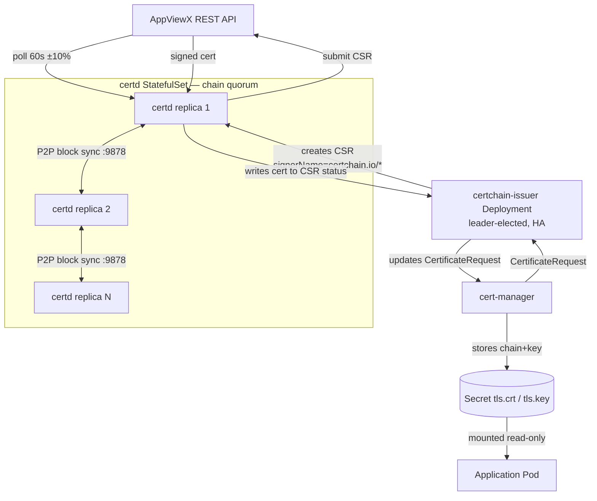

# certchain architecture

certchain is a standalone Go blockchain that records AppViewX-issued X.509
certificates and exposes them to any cluster member. Kubernetes workloads
get certs via a cert-manager external issuer (`certchain-issuer`) that
translates `CertificateRequest` objects into on-chain CSRs.

## Data flow

## Components

| Component | Kind | Notes |
|-----------|------|-------|
| `certd` | StatefulSet | Blockchain node. Polls AVX, validates blocks against the `validators.json` allowlist (CM-23), serves query API on `:9879`, exposes `/readyz` and `/metrics` on `:9880` (CM-27). |
| `certchain-issuer` | Deployment (replicas ≥ 2) | cert-manager external issuer. Leader-elected via a Lease (CM-22); only the leader processes `CertificateRequest`s. |
| `CertchainClusterIssuer` / `CertchainIssuer` | CRDs (`certchain.io/v1alpha1`) | Bind a `signerName` to an issuer reference. Cluster-scoped and namespace-scoped variants. Status subresource with `Ready` + `Age` printer columns (CM-26). |
| `cert-manager` | Third-party | v1.13+. Generates private keys, creates `CertificateRequest`s, stores Secrets, auto-renews. |

## Trust boundaries

- Private keys are generated inside the cluster by cert-manager and never
  leave; only the CSR is submitted to AVX.
- certd validates that the CSR signer is on the `validators.json`
  allowlist before admitting the block (CM-23).
- Secrets are deleted when the corresponding cert is revoked on chain
  (CM-25); the `certchain-issuer` emits a Kubernetes Event and drops the
  `tls.crt` so workloads fail closed.

See `spec/FAILURES.md` for the full tenet list.
